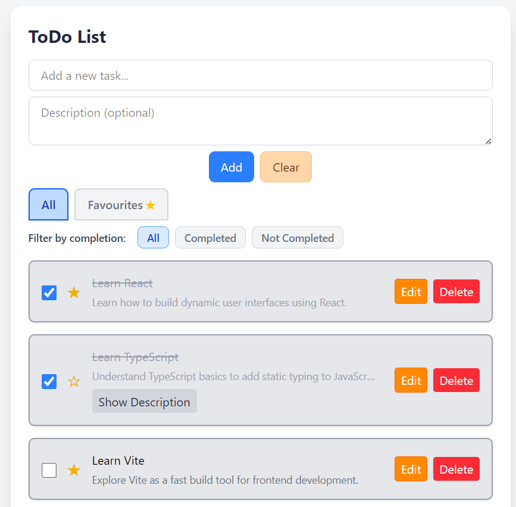

# Technical Test: Todo App

## Description

Todo management application (Todo App) developed as a technical test. It allows you to add, delete, mark as completed, add descriptions, and mark tasks as favorites. The backend is built with FastAPI and the frontend with Vite + React + TypeScript.

## App Screenshot




## Main Features

- Add, edit, and delete tasks
- Mark tasks as completed
- Add a description to each task
- Mark/unmark tasks as favorites
- Filter by completion status and by favorites
- Modern and responsive UI

## Project Structure

- **backend/**: REST API with FastAPI and JSON file storage.
  - `app/main.py`: API entry point.
  - `app/routes/todos.py`: Endpoints and business logic for todos.
  - `app/models/todo_model.py`: Pydantic models for todos.
  - `app/test_main.py`: Backend test with pytest.
- **frontend/**: Web app with React + TypeScript.
  - `src/`:
    - `components/`: Reusable UI components (TodoList, TodoItem, TodoForm, etc.)
    - `hooks/`: Custom React hooks for todos and filtering
    - `api/`: API abstraction for backend communication
    - `types/`: TypeScript type definitions (Todo)
    - `assets/`: Static assets (images, icons)
    - `App.tsx`, `main.tsx`, etc.: App entry and main logic

## Installation & Usage

### Backend (FastAPI)

1. Go to the backend folder:
   ```bash
   cd backend
   ```
2. Create a virtual environment and install dependencies:
   ```bash
   python -m venv .venv
   source .venv/bin/activate  # On Linux/Mac
   # .venv\Scripts\activate  # On Windows
   pip install -r requirements.txt
   ```

### Frontend (Vite + React)

1. Go to the frontend folder:
   ```bash
   cd frontend
   ```
2. Install dependencies:
   ```bash
   npm install
   ```
3. Run the application (backend + frontend):
   ```bash
   npm run dev
   ```
4. Open your browser at [http://localhost:5173](http://localhost:5173)

## Testing

To run backend automated tests:

1. From the `backend` folder:
   ```bash
   pytest
   ```

## Notes

- The backend stores data in a `todos.json` file inside the `app` folder.
- The frontend consumes the backend REST API.
- The project is ready to run and test locally on Windows, Linux, or Mac.
